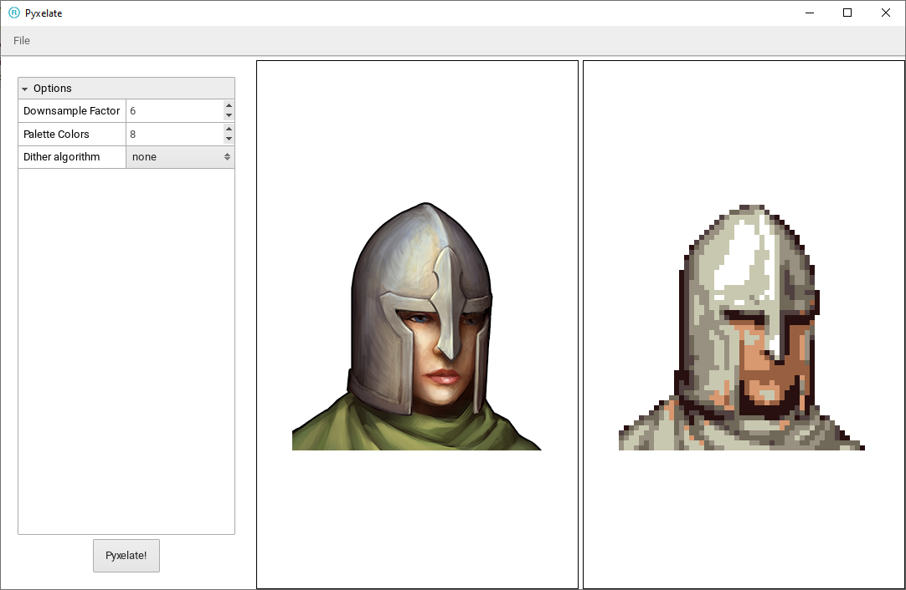

# pyxelate-interface
A GUI for pyxelate. Pyxelate is a tool written in Python to basically downsample images and reduce their palette.

You can read more on pyxelate here: https://github.com/sedthh/pyxelate

## Setup
Before you attempt to run the program in this repo first you need to:
- Have Python installed (I was only able to make pyxelate work with Python 3.8)
- Install pyxelate and its dependencies (Please mind the versions. More info at https://github.com/sedthh/pyxelate)
- To build this project you need to have its dependecies installed with haxelib:
  - haxeui-core: [git]
  - haxeui-openfl: [git]
  - openfl: [git]

## Screenshot

